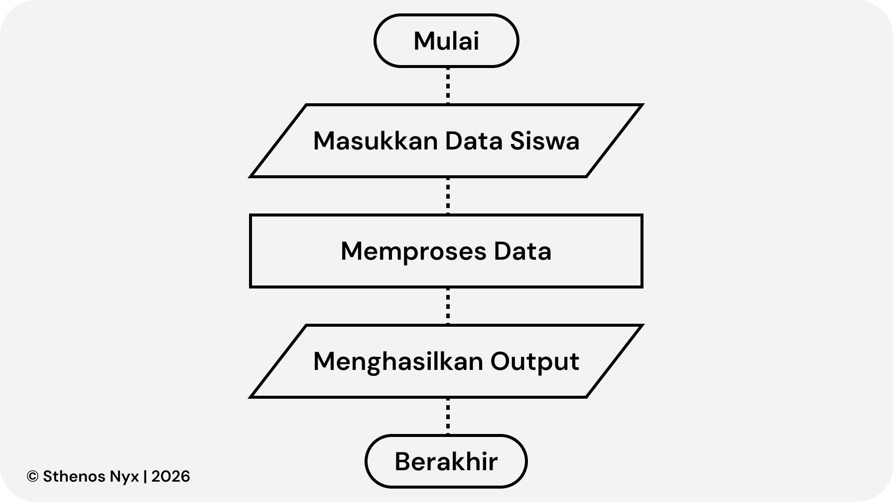
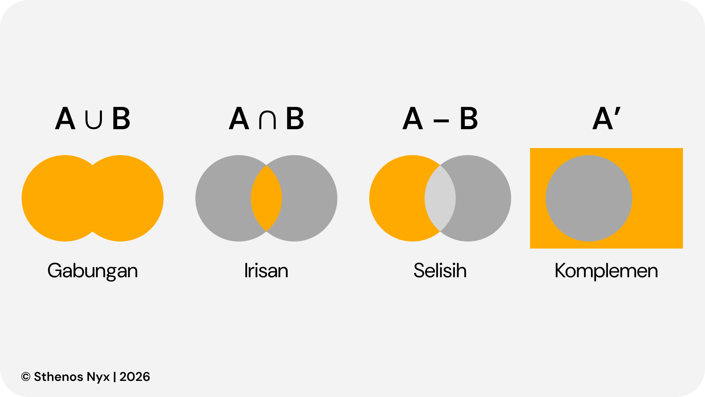

## Identitas Materi

* **Mata Pelajaran:** Informatika
* **Kelas:** 8
* **Bab:** 2
* **Tanggal:** Senin, 31 Juli 2026
* **Materi:** Berpikir Komputasional
* **Pemateri:** Ustadz Syaiful, S.Kom., Gr.
* **Status:** Belum diketahui

---

## Dalam Materi Ini
* [Fungsi Komputasi](#fungsi-komputasi)
* [Himpunan](#himpunan)
* [Data Terstruktur](#data-terstruktur)
* [Persoalan Logika dengan Himpunan](#persoalan-logika-dengan-himpunan)
* [Representasi Bilangan](#representasi-bilangan)

> [!NOTE]
> Mengapa BAB 2 didahulukan sebelum BAB 1? Menurut jawaban dari Pemateri bahwa:
>> "...Karena fasilitas komputer kita yang masih belum memadai dan BAB 1 itu kebanyakan praktik, jadi saya dahulukan BAB 2 dulu..."

---

# Berpikir Komputasional

<h2 id="fungsi-komputasi">Fungsi Komputasi</h2>

  Dalam Informatika, **Fungsi** adalah mekanisme yang menerima masukan (input), mengolah (proses), kemudian menghasilkan keluaran (output). Serupa dengan proses komputasi.   Salah satu contoh sederhana:
1. Input - Nilai Siswa
2. Proses - Menghitung nilai rata-rata
3. Output - Nilai Akhir
   

<h2 id="himpunan">Himpunan</h2>

  **Himpunan** adalah kumpulan objek yang memiliki kesamaan ciri yang jelas sehingga dapat ditentukan apakah termasuk elemen/individu dalam sebuah himpunan atau tidak.

<h2 id="data-terstruktur">Data Terstruktur</h2>

  **Data Terstruktur** adalah data yang tersusun secara rapi sehingga mudah dibaca dan diolah.   Berikut ialah manfaatnya:
  1. Mudah dicari
  2. Mudah diolah
  3. Mudah dianalisis
  4. Mengurangi kesalahan

<h2 id="persoalan-logika-dengan-himpunan">Persoalan Logika dengan Himpunan</h2>

  **Himpunan Data Terstruktur** juga dapat digunakan untuk memecahkan persoalan logika dengan memanfaatkan operasi himpunan agar lebih terorganisir.
  ### Operasi Himpunan
  * Gabungan (∪) &ndash; Semua anggota dari semua himpunan
  * Irisan (∩) &ndash; Anggota yang sama
  * Selisih (–)  &ndash; Anggota yang hanya ada pada salah satu himpunan
  * Komplemen (') &ndash; Semua elemen dalam semesta yang tidak ada dalam himpunan
    

  > [!IMPORTANT]
  > Karena adanya perbedaan antara materi tercatat dengan buku referensi yaitu bagian Komplemen. Berikut penjelasannya:  **Komplemen** = anggota semesta yang **bukan** anggota himpunan. **Contoh** Semesta S = {1, 2, 3, 4, 5} Himpunan A = {1, 2, 3} Maka A' atau Komplemen dari A = {4, 5}  **Sifat Penting** <ul><li>(A')' = A</li><li>A ∪ A' = S</li><li>A ∩ A' = Ø</li></ul>

<h2 id="representasi-bilangan">Representasi Bilangan</h2>

  **Representasi bilangan** adalah cara menuliskan atau menyatakan suatu angka menggunakan sistem bilangan tertentu, seperti desimal, biner, oktal, dan heksadesimal. Walaupun penulisannya berbeda, nilai bilangannya tetap sama.

<table>
  <thead>
    <tr>
      <th>Desimal (Basis 10)</th>
      <th>Biner (Basis 2)</th>
      <th>Oktal (Basis 8)</th>
      <th>Heksadesimal (Basis 16)</th>
    </tr>
  </thead>
  <tbody>
    <tr>
      <!-- DESIMAL -->
       <td valign="top">Sistem bilangan yang paling sering  digunakan sehari-hari. 
         <b>Ciri-ciri:</b>
         <ul>
         <li>
           Basis = 10
         </li>
         <li>
           Digit = 0 sampai 9
         </li>
         <li>
           Contoh = 25, 125, 2024
         </li>
        </ul>
        
Contoh: 202410

        <table align="center">
          <thead>
            <tr>
              <th>Ribuan</th>
              <th>Ratusan</th>
              <th>Puluhan</th>
              <th>Satuan</th>
            </tr>
          </thead>
          <tbody>
            <tr>
              <td>2</td>
              <td>0</td>
              <td>2</td>
              <td>4</td>
            </tr>
            <tr>
              <td>2x103</td>
              <td>0x102</td>
              <td>2x101</td>
              <td>4x100</td>
            </tr>
          </tbody>
        </table>
      </td>
      <!-- BINER -->
      <td valign="top"> Sistem bilangan yang digunakan komputer karena hanya mengenal 2 keadaan (1 dan 0). 
        <b>Ciri-ciri:</b>
        <ul>
          <li>Basis</li>
          <li>Digit</li>
          <li>Contoh: 1010, 1100, 11110011</li>
        </ul>
        
Contoh: 10112

        <table align="center">
          <thead>
            <tr>
              <th>23</th>
              <th>22</th>
              <th>21</th>
              <th>20</th>
            </tr>
          </thead>
          <tbody>
            <tr>
              <td>1</td>
              <td>0</td>
              <td>1</td>
              <td>1</td>
            </tr>
            <tr>
              <td>8</td>
              <td>0</td>
              <td>2</td>
              <td>1</td>
            </tr>
          </tbody>
        </table>
      </td>
      <!-- OKTAL -->
      <td valign="top"> Sistem bilangan dengan basis 8, menggunakan digit 0-7. 
        <b>Ciri-ciri:</b>
        <ul>
          <li>Basis = 8</li>
          <li>Digit = 0 sampai 7</li>
          <li>Contoh = 17, 125, 765</li>
        </ul>
        
Contoh: 178

        <table align="center">
          <thead>
            <th>82</th>
            <th>81</th>
            <th>80</th>
          </thead>
          <tbody>
            <tr>
              <td>1</td>
              <td>7</td>
              <td>0</td>
            </tr>
            <tr>
              <td>64</td>
              <td>8</td>
              <td>1</td>
            </tr>
          </tbody>
        </table>
      </td>
      <td valign="top">Sistem bilangan dengan basis 16, menggunakan digit 0-9 dan A-F. 
        <b>Ciri-ciri:</b>
        <ul>
          <li>Basis = 16</li>
          <li>Digit = 0-9 dan A-F</li>
          <li>Contoh = 1A, 2F, 3E, FF</li>
        </ul>
        
Contoh: 2F16

        <table align="center">
          <thead>
            <tr>
              <th>161</th>
              <th>166</th>
            </tr>
          </thead>
          <tbody>
            <tr>
              <td>2</td>
              <td>F</td>
            </tr>
            <tr>
              <td>32</td>
              <td>15</td>
            </tr>
          </tbody>
        </table>
      </td>
    </tr>
  </tbody>
</table>
 
<table>
  <thead>
    <tr>
      <th colspan="17">Digit pada Heksadesimal</th>
    </tr>
  </thead>
  <tbody>
    <tr>
      <td>Desimal (Basis 10)</td>
      <td>0</td>
      <td>1</td>
      <td>2</td>
      <td>3</td>
      <td>4</td>
      <td>5</td>
      <td>6</td>
      <td>7</td>
      <td>8</td>
      <td>9</td>
      <td>10</td>
      <td>11</td>
      <td>12</td>
      <td>13</td>
      <td>14</td>
      <td>15</td>
    </tr>
    <tr>
      <td>Heksadesimal (Basis 16)</td>
      <td>0</td>
      <td>1</td>
      <td>2</td>
      <td>3</td>
      <td>4</td>
      <td>5</td>
      <td>6</td>
      <td>7</td>
      <td>8</td>
      <td>9</td>
      <td>A</td>
      <td>B</td>
      <td>C</td>
      <td>D</td>
      <td>E</td>
      <td>F</td>
    </tr>
  </tbody>
</table>

---

### Referensi:
  [^1]:
  * Suryodiningrat, S. P., Permana, N. V., Qomariyah, N. N., & Subeno, B. (2025). *Informatika untuk SMP/MTs Kelas VIII*. Penerbit Erlangga

### Kontributor:
  * **Iqbal G.I.** (Penulis, Perangkum)
